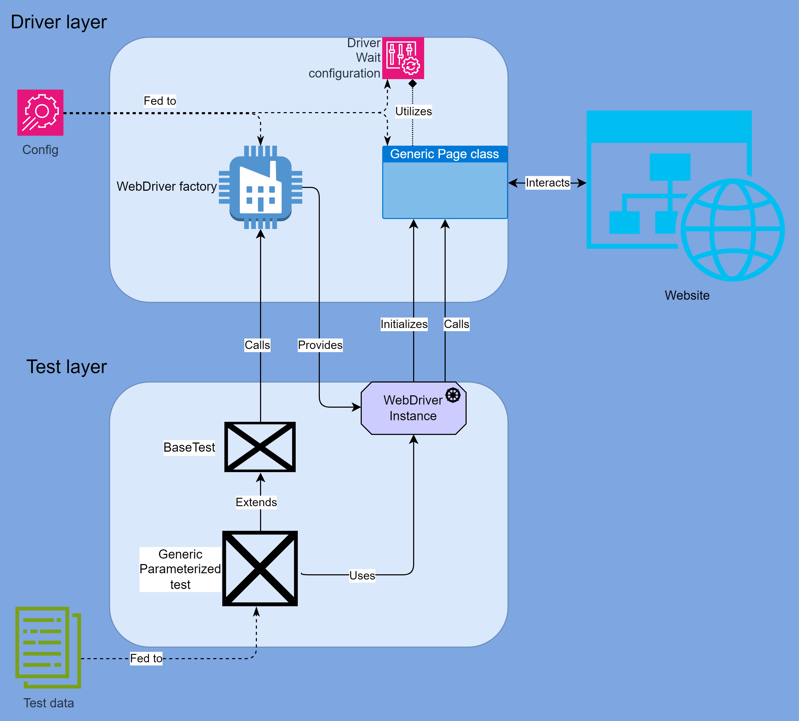

sup
- [What the actual fuck](#what-the-fuck-is-even-that-interrobang)
- [Environment configuration](#env-config-example)
- [Driver configuration](#driver-config-example)
- [Feed data to parameterized tests through YAML](#customer-test-data-example)
- [How does it work](#how-does-it-work)
- [Project structure](#project-structure)
- [High level diagram overview of project code](#high-level-overview)
- [Class diagram](#class-diagram)
- [Driver layer overview](#driver-layer)
- [Test layer overview](#test-layer)
- [P.S.](#ps)
- [TL;DR](#tldr)
- [What's next](#whats-next)
# WHAT THE FUCK IS EVEN THAT? :interrobang:

You may say. And the answer is... 
# :neckbeard:

Configurable UI tests with raw ==Selenium== and ==Junit==. With "auto-waits" and stuff. 
# :cool:

| Configuration           | Default file location                                      | Custom file path program arg |
|-------------------------|------------------------------------------------------------|------------------------------|
| Env configuration       | `src/main/resources/environment.yml`                       | `envConfigFilePath`          |
| Driver configuration    | `src/main/resources/driver.yml`                            | `driverConfigFilePath`       |
| Customer test data feed | `src/test/resources/data/customer-tests-data-provider.yml` | `customerTestDataFilePath`   |

### Env config example:
```yaml
# URL of application under test
appUrl: https://2girls1cup.com/
# URL of Selenium Grid to connect to (for Remote Drivers)
gridUrl: http://my.grid.url/wd/hub
# true if Selenoid Grid is to be used
selenoidEnabled: true
# Selenoid Grid option (enables VNC connections to remote driver sessions)
selenoidVncEnabled: true
# Selenoid Grid option (captures video recordings of remote driver sessions)
selenoidVideoEnabled: false
```

### Driver config example:

```yaml
# WebDriver fluent wait timeout in ms
waitTimeoutMillis: 10000
# WebDriver default implicit wait time in ms
implicitWaitMillis: 500
# WebDriver fluent wait polling interval in ms
pollingIntervalMillis: 50
# WebDriver page load timeout in ms
pageLoadTimeoutMillis: 10000
chromeLocalLoggingEnabled: true
chromeLocalLogPath: src/test/resources/logs
firefoxLocalLoggingEnabled: true
firefoxLocalLogPath: src/test/resources/logs
```
### Customer test data example:
```yaml
# Set of test data goes here
data:
    # Driver type used for the test
  - driverType: CHROME_REMOTE
    # Set of Customer domain objects provided for the test 
    customers:
      - name: Bob
        email: uncle-bob-molester-420@gmail.com
        age: 69
        gender: MALE
      - name: Paul
        email: paul@paul.paul
        age: 30
        gender: MALE
  - driverType: CHROME_REMOTE_HEADLESS
    customers:
      - name: Alice
        email: heriohgeri@giewhgwoieg.gewihgw
        age: 25
        gender: FEMALE
      - name: agiehgiewbovw
        email: xxx@xx.io
        age: 90
        gender: DIFFERENT

```


Number of fork threads for tests is currently specified in `build.gradle.kts` but probably should be moved to
configuration as well.

## HOW DOES IT WORK

#TODO: use different tool(s) to make better diagrams

### Project structure
```
├───ui-tests
│   └───src
│       ├───main
│       │   ├───java
│       │   │   └───org
│       │   │       └───springsandbox
│       │   │           ├───config
│       │   │           │   └───test_data
│       │   │           │       └───customer
│       │   │           ├───domain
│       │   │           ├───enums
│       │   │           ├───essence
│       │   │           ├───factories
│       │   │           ├───pages
│       │   │           └───utils
│       │   └───resources
│       └───test
│           ├───java
│           │   ├───extensions
│           │   ├───generators
│           │   ├───helpers
│           │   ├───matchers
│           │   ├───tests
│           │   └───utils
│           └───resources
│               └───data
```


It is divided into driver and test layers.

Driver layer has:
- configuration classes, data to which is fed from external configs.
- WebDriver Factory class.
- Domain classes.
- Utility classes for WebDriver Waiting and Logging logic.
- Page Object Model classes with Page classes inheritting from BasePage class, which contains core webpage interaction logic.

Test layer has:
- Junit abstract web test.
- Junit tests inheriting from abstract test.
- Test helpers.
- Test matchers.
- Test extensions.
- Test utilities.
- Test data feeders.

### High level overview



### Class diagram


## Driver layer

`src/main/java/org.springsandbox/utils` package contains utility classes:
* Singleton class which instantiates and provides `ObjectMapper` object. It is used for reading YAML configuration files and mapping them into respective config classes;
* Driver logger utility class which contains static method(s) for collecting, providing and logging `WebDriver` log entries;
* Configuration class that reads data from YAML configs and instantiates config objects to be used across driver layer;
* Driver wait configuration class which configures `WebDriver` instance's fluent and implicit waits, and contains decorator methods for elements waiting, page load finish waiting while disabling/re-enabling implicit waits to not mix it with explicit ones (cuz mixing is bad, mkay?).

Driver factory class `src/main/java/org.springsandbox/factories/WebDriverFactory.java`
is responsible for supplying `WebDriver` object for requested `DriverType`.
It configures options, program arguments, log preferences and instantiates `WebDriver`.

`WebDriver`'s types are defined in enum class at 
`src/main/java/org.springsandbox/enums/DriverType.java`.

Page object classes which contain page elements and interaction logic are located in 
`src/main/java/org.springsandbox/pages` package.

The `BasePage.java` abstract class defines common 
fields and elements interactions logic to be re-used by all page classes inheriting from it.
It utilizes underlying waiting logic encapsulated in `src/main/java/org.springsandbox/utils/DriverWaitConfiguration.java`
class to dynamically wait for elements before interacting with them and automatically re-initializes `PageFactory` on `StaleElementReferenceException`.
So that you don't need to worry about any of it when implementing other Page classes on top of it.

`src/main/java/org.springsandbox/domain` package contains domain classes.

`src/main/java/org.springsandbox/config` contains config classes and test data provider classes to which sir `ObjectMapper` maps your YAML configuration files.

## Test layer

Tests are located in `src/test/java/tests` package.

`BaseTest.java` outlines JUnit abstract test class with JUnit test extensions, execution mode,
test tags, fields and hooks that are common among all tests.
More specifically it contains:
* Thread safe `ThreadLocal<?>` variables for your `WebDriver` and `Logger` objects,
* `ScreenshotExtension` test extension that attaches screenshot to [Allure](https://allurereport.org/) results for your failed test,
* `setupDriver(DriverType driverType)` method that calls `WebDriverFactory` to instantiate `WebDriver` object of provided `DriverType`, puts it into `ThreadLocal<WebDriver>` variable and sets this driver instance for JUnit test extensions,
* `@BeforeEach` hook that instantiates logger object,
* `@AfterEach` hook that attaches WebDriver logs to your [Allure](https://allurereport.org/) results and quits the `WebDriver`.

Other test classes inherit from it and can and should be written in a parameterized way. That way you can provide driver types, test domain objects and other data you need via data provider methods, CSVs, YAMLs or otherwise.

`utils` package contains `Faker` provider singleton class, test data provider class to read data for your tests from YAML files and `TestStep` utility class with decorator methods that mark [Allure](https://allurereport.org/) steps and log this step at the same time.

`matchers` contains re-usable custom matchers for your tests.

`helpers` contains re-usable test steps for your test (e.g. login/logout/do this/do that, which may combine a number of more basic page interaction calls...)

`generators` contains domain object generator classes.

And finally `extensions` for your JUnit test extension classes if you need those.

That's about it. Thanks. Bye. Have a nice life/everything else.

## P.S.
Never actually use this shit. Better stick with your Playwright or whatever. 
Or, better yet, find a better job/career/the thing you do with your limited time in this universe in this timespan you are entrapped in.
Anyway, you do you, you surely know better... And don't let the bastards get to you. Or do. If you feel like. 

:frog::frog::frog::frog:
:rocket::rocket::rocket::rocket:

## TLDR:
Data-driven :rocket:, cross-browser :rocket:, concurrent/parallel :rocket:, "scalable" :frog: UI tests project skeleton sample with:
* [x] raw [Selenium](https://www.selenium.dev/),
* [x] parameterized [JUnit](https://junit.org/junit5/) tests,
* [x] [Allure](https://allurereport.org/) reporting,
* [x] driver and tests layers responsibility separation,
* [x] [POM](https://www.selenium.dev/documentation/test_practices/encouraged/page_object_models/),
* [x] `WebDriver` factory,
* [x] [Selenoid](https://aerokube.com/selenoid/latest/) grid ready,
* [x] auto-fluent waits and `PageFactory` re-init,
* [x] tag based tests launch configuration,
* [x] failed test retries,
* [x] [Allure TestOPS](https://qameta.io/) friendly test markup (that is actually generated automatically with import via integration IDE plugin btw),
* [x] Allure screenshots attachments,
* [x] Allure `WebDriver` logs attachments,
* [x] YML test data feed,
* [x] YML environment and `WebDriver` configuration,
* [x] domain object generators,
* [x] test helpers and matchers.

Don't. Made this for job interview purposes with a certain level of absurdity in mind.

# WHAT'S NEXT?

- **Fractal Testing Patterns:** a system where tests mimic fractals. For every test case, sub-tests are generated recursively, with parameters that change dynamically based on the previous test results. This way, test suite can expand and morph like a fractal, leading to unexpected behaviors.

- **AI-Powered Test Case Generation:** implement an AI that observes application in real-time and generates test cases based on user behavior patterns. We need to train a model to recognize common paths and generate unexpected edge cases to test those flows.

- **Chaos Engineering for Tests:** integration of chaos engineering principles by deliberately injecting faults into application during test runs. For example, we could randomly take down backend services or simulate network latency and see how tests respond.

- **Holographic UI Testing:** a way to visualize UI tests in a holographic or augmented reality space. This could help understand complex UI interactions in a new dimension—literally!

- **Quantum Testing:** dive into the absurd and create a testing environment that simulates quantum mechanics principles. For example, a test could have multiple states until it's observed (i.e., executed), leading to unpredictable outcomes.

- **Self-Modifying Tests:** tests that can change their own logic based on certain conditions or previous outcomes. This could lead to some truly bizarre test scenarios where the tests adapt in real-time.

- **Gamification of Testing Process:** a game-like environment where passing tests earn points and unlock new challenges. With some absurd challenges like “only test this UI element while blindfolded” or “execute a test on a random day of the week for no reason.”

- **A/B Testing Gone Wild:** extreme A/B testing scenarios where features are rapidly toggled on and off, and observe the impacts on test outcomes.

- **Meme-Driven Development:** inject memes into framework — every test requires a corresponding meme, and the results could be judged by the community based on their comedic value.

- **Narrative Integration:** a storyline around tests where every test case has a backstory. As tests pass or fail, they advance the narrative, turning testing framework into an epic saga of UI interactions.